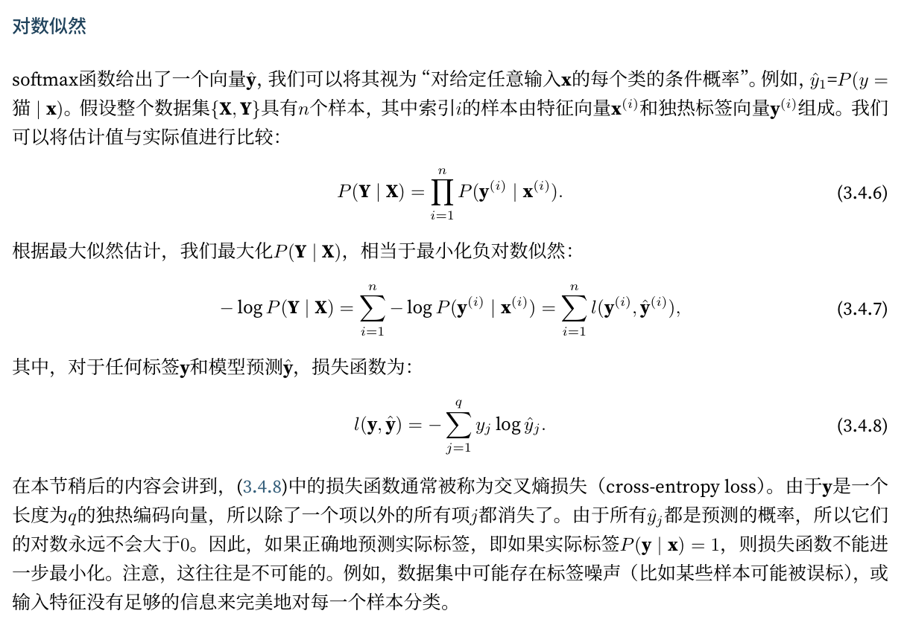

# 3.4 softmax回归

## 3.4.1 从回归到分类
+ 回归：一个输出
+ 分类：多个输出

## 3.4.4 softmax运算
softmax运算：输入向量X，输出向量Y，其中$$ Y[i] = \frac{\exp(X[i])}{\sum_j \exp(X[j])} $$
## 3.4.6 损失函数

注：
1. 最大似然估计和最小二乘估计本质等价。（**在线性回归和噪声符合高斯的情况下**）

2. 因为最大似然函数有连乘项用对数化简。

##  3.4.7 信息论&交叉熵

+ 熵：信息量的期望。
+ 信息量等于对某件事情主观赋予概率的负对数，**这个概率较低时，“惊异”会更大，信息量就更大**。
+ 交叉熵：主观概率为Q的观察者在看到根据概率P生成的数据时的预期惊异，**当P = Q时，交叉熵为最低等于$ H(P) $**

